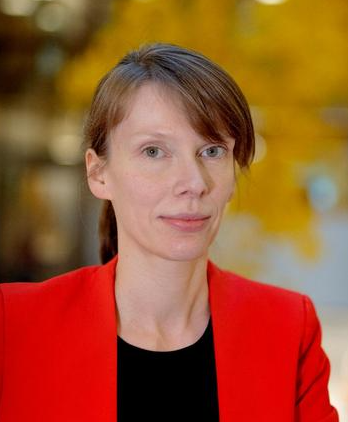

See also [the event page](https://climateainordics.com/events/2026-nordic-workshop) for additional information incl. on registration!

## Schedule

| Time | Category | Speaker | Title/Topic |
| ---- | -------- | ------- | ----------- |
| 8:30 | | Coffee/find your seat | | 
| 9:00-10:20 | | _**Session 1**_ | *Session Chair: Nico Lang* |
| &nbsp;&nbsp;&nbsp;&nbsp;9:00 | Opening remarks | Ankit Kariryaa | |
| &nbsp;&nbsp;&nbsp;&nbsp;9:10 | Keynote | [Céline Heuzé](#celine) | [AI and the Arctic](celine) |
| &nbsp;&nbsp;&nbsp;&nbsp;9:50 | Selected oral #1 | [Fuxing Wang](#fuxing) | [Emulating land–atmosphere feedbacks in convection-permitting regional climate models using machine learning](#fuxing) | 
| &nbsp;&nbsp;&nbsp;&nbsp;10:00 | Selected oral #2 | [Gabrielė Tijūnaitytė](#gabriele) | [Language Alignment for Explainable Predictions from Geospatial Foundation Models](#gabriele) |
| &nbsp;&nbsp;&nbsp;&nbsp;10:10 | Selected oral #3 | [Aprilia Nidia Rinasti](#aprilia) | [MethaneState: A Multimodal Satellite Remote Sensing Benchmark Dataset for Methane Mapping](#aprilia)  |
| 10:20 | | Coffee break |  |
| 11:00-11:45 | | _**Session 2**_ | *Session Chair: Olof Mogren* |
| &nbsp;&nbsp;&nbsp;&nbsp;11:00 | Invited talk | [Joakim B Haurum](#joakim) | [Computer Vision and Multimodal AI for Ecological Monitoring](#joakim) |
| &nbsp;&nbsp;&nbsp;&nbsp;11:25 | Selected oral #4 | [John Martinsson](#john) | A multimodal audio-video dataset for AI-based monitoring of a Baltic seabird colony under climate change |
| &nbsp;&nbsp;&nbsp;&nbsp;11:35 | Selected oral #5 | [Hui Zhang](#hui) | [A vertical vegetation structure model of the Earth](#hui) |
| &nbsp;&nbsp;&nbsp;&nbsp;11:45 | Selected oral #6 | [Miguel Costa](#miguel) | [Learning long term climate adaptation pathways for flooding impacts using reinforcement learning](#miguel) |
| 11:55 | | Lunch |  |
| 13:00-14:30 | | _**Session 3: Industry**_ | *Session Chair: Ankit Kariryaa* |
| 14:30 | | Coffee break |  |
| 15:10-16:30 | | _**Session 4**_ | *Session Chair: Aleksis Pirinen* |
| &nbsp;&nbsp;&nbsp;&nbsp;15:10 | Invited talk | [Frida Berry Eklund](#frida) | [Building Radical Climate Transparency with AI – Inside Klimatkollen’s mission to make emissions data available to citizens on Wikipedia](#frida) |
| &nbsp;&nbsp;&nbsp;&nbsp;15:40 | Selected oral #7 | [James White](#james) | [Green-Teaming AI: Noticing ‘the (missing) environment’ in generative AI](#james) |
| &nbsp;&nbsp;&nbsp;&nbsp;15:50 | Selected oral #8 | [Sai Ganesh Veeravalli](#sai) | [Making urban deprivation visible for climate adaptation planning](#sai) |
| &nbsp;&nbsp;&nbsp;&nbsp;16:00 | Panel discussion | Invited panelists | Thematic questions of 2026 workshop |
| &nbsp;&nbsp;&nbsp;&nbsp;16:35 | Closing remarks | Aleksis Pirinen and Olof Mogren |  |
| 16:40 | | Posters and mingle |  |
| 17:45 | | Relocation to social | |
| 18:15 | | Social activity | Ferry ride in Copenhagen to the dinner |
| 19:00 | | Dinner | Reffen, the largest outside street food court in the Nordics |

## 16:40 - 17:45 Poster presentations



| No. | Speaker | Title |
| ---- | -------------------------- | --------------------------------------------------------------- |
| {{ presentation_number }}   | [Céline Heuzé](#celine) | [AI and the Arctic](#lucia) |

| {{ presentation_number }}  | [Joakim Haurum](#joakim) | [Computer Vision and Multimodal AI for Ecological Monitoring](#joakim) |

| {{ presentation_number }}  | [Frida Berry Eklund](#frida) | [Radical Climate Transparency with Garbo AI](#frida) |

| {{ presentation_number }}   | [Lucia Gordon](#lucia) | [MMEarth-Bench: Global Model Adaptation via Multimodal Test-Time Training](#lucia) |

| {{ presentation_number }}   | [Laura Helene Rasmussen](#laura) | [Bias quantification and data-based correction model of MODIS LST in the pan-Arctic](#laura) |

| {{ presentation_number }}   | [Fuxing Wang](#fuxing) | [Emulating land–atmosphere feedbacks in convection-permitting regional climate models using machine learning](#fuxing) |

| {{ presentation_number }}  | [Miguel Costa](#miguel) | [Learning long term climate adaptation pathways for flooding impacts using reinforcement learning](#miguel) |

| {{ presentation_number }}  | [James White](#james) | [Green-Teaming AI: Noticing ‘the (missing) environment’ in generative AI](#james) |

| {{ presentation_number }}  | [Venkanna Babu Guthula](#venkanna) | [Align and Segment: Unsupervised Learning for Building Segmentation From Misaligned Labels](#venkanna) |

| {{ presentation_number }}  | [Sai Ganesh Veeravalli](#sai) | [Making urban deprivation visible for climate adaptation planning](#sai) |

| {{ presentation_number }}  | [Gabrielė Tijūnaitytė](#gabriele) | [Language Alignment for Explainable Predictions from Geospatial Foundation Models](#gabriele) |

| {{ presentation_number }}  | [Georgios Filippis](#georgios) | [Grey to Green: Identifying Urban Greening Opportunities using AI](#georgios) |

| {{ presentation_number }}  | [Aprilia Nidia Rinasti](#aprilia) | [MethaneState: A Multimodal Satellite Remote Sensing Benchmark Dataset for Methane Mapping](#aprilia) |

| {{ presentation_number }}  | [Alouette van Hove](#alouette) | [Active Learning for Methane Flux Mapping](#alouette) |

| {{ presentation_number }}  | [Max Angenius](#max) | [Small & Medium-Sized Enterprises at the Societal and Planetary Crossroads: The Herculean Choice of Using Sustainable or Unsustainable AI](#max) |

| {{ presentation_number }}  | [Isabelle Tingzon](#isabelle) | [Cross-resolution Feature Distillation for High-resolution Flood Mapping using Sentinel-1 and 2](#isabelle) |

| {{ presentation_number }}  | [Linda Hartman](#linda) | [InfraVis – The National Research Infrastructure For Data Analysis and Visualization](#linda) |

| {{ presentation_number }}  | [Hui Zhang](#hui) | [A vertical vegetation structure model of the Earth](#hui) |

| {{ presentation_number }}  | [Shorouq Zahra](#shorouq) | [SciDCC+: Robustifying a Weakly Labelled Benchmark in the Climate Domain](#shorouq) |

| {{ presentation_number }}  | [John Martinsson](#john) | [A multimodal audio-video dataset for AI-based monitoring of a Baltic seabird colony under climate change](#john) |

| {{ presentation_number }}  | [Luca Ciampi](#luca) | [Neuro‑Inspired Visual Pattern Recognition via Biological Reservoir Computing](#luca) |
| {{ presentation_number }}  | Sai Ganesh Veeravalli | [SESAC - Centre for Satellite Data in Social Research](https://www.sam.lu.se/en/sesac) |


## Speaker instructions.

For speakers, see presentation instructions [here](speaker-instructions.html).

## Presentation details



**{{ presentation_number }}. Céline Heuzé**, University of Gothenburg, Sweden 
**Title:** AI and the Arctic 
**Presentation type:** Keynote, Poster  
**Abstract:** The Arctic is the place on Earth changing fastest and most profoundly in response to climate change. At the same time, its already complex geopolitical situation has dramatically worsened recently, with large areas now off limit to scientists, while its economic exploitation has exploded. That is, there is simultaneously an urgent need for climate and biodiversity research in the Arctic, and seriously reduced means to conduct this research in the field. Can AI close this gap? In this talk, I will present what has already been done with AI in the Arctic, discuss which areas of research are promising, but also reflect on the remaining limitations and some ethical considerations.  
**Bio:** Céline is docent and Senior Lecturer in climatology at University of Gothenburg. She uses in-situ observations, climate models, AI and remote sensing to study the interactions between deep ocean, sea ice / glaciers, and atmosphere, mostly in the Arctic for now. She is a receiver of the 2022 Ocean Science division Outstanding Early Career Scientist award of the European Geosciences Union (EGU), and the 2024 Royal Society of Arts and Sciences in Gothenburg (KVVS) Birger Karlsson science prize. 
**More info:** [https://www.gu.se/om-universitetet/hitta-person/celineheuze](https://www.gu.se/om-universitetet/hitta-person/celineheuze)

[Back to top of page](#top)



**{{ presentation_number }}. Joakim Haurum**, University of Southern Denmark & Pioneer Centre for AI, Denmark 
**Title:** Computer Vision and Multimodal AI for Ecological Monitoring 
**Presentation type:** Invited talk
**Abstract:** Measuring biodiversity is crucial for understanding ecosystem health. However, differentiating different species often requires taxonomists who have acquired expert level knowledge over several years. This is both time inefficient and the science of taxonomy has been de-prioritized over the years. Therefore, developing Computer Vision and AI methodologies and benchmarks specifically for biodiversity monitoring is of great importance, in order to alleviate, assist, and enable domain experts. In this talk, I will present recent work from the BIOSCAN-ML group where we have developed the multimodal benchmarks and methods for insect biodiversity monitoring. Uniquely these developments no only work on images of insects, but also incorporate the strong domain knowledge embedded into DNA barcode and text-based representations of taxonomic labels. 
**Bio:** Joakim is an Assistant Professor at the University of Southern Denmark, and also affiliated with the Pioneer Centre for Artificial Intelligence. Joakim works on both foundational machine learning and computer vision, as well as their application in domains such as biodiversity monitoring. His recent work centers on handling messy, real‑world expert data and designing computer vision models that can generalize in open‑world conditions—critical for large‑scale biodiversity assessment. 
**More info:** [https://joakimhaurum.github.io/](https://joakimhaurum.github.io/)

[Back to top of page](#top)



**{{ presentation_number }}. Frida Berry Eklund**, Klimatkollen, Sweden 
**Title:** Radical Climate Transparency with Garbo AI 
**Presentation type:** Invited talk, Poster
**Abstract:** Building Radical Climate Transparency with AI – Inside Klimatkollen’s mission to make emissions data available to citizens on Wikipedia 
**Bio:** Frida is a Swedish climate strategist, author, and activist specializing in climate communication and civic engagement. She serves as a co-founder and spokesperson of the Swedish climate organisation, Klimatkollen – an independent, AI-powered platform designed to make climate data—such as corporate and municipal carbon emissions—accessible and transparent for the general public. Her role focuses on bridging the gap between complex data and public understanding to hold policymakers accountable. Frida is also appointed European Climate Pact Ambassador, promoting civic climate action across Europe.
**More info:** [https://climate-pact.europa.eu/meet-community/climate-pact-ambassadors/frida-berry-eklund_en](https://climate-pact.europa.eu/meet-community/climate-pact-ambassadors/frida-berry-eklund_en)

[Back to top of page](#top)



**{{ presentation_number }}. Lucia Gordon**, Harvard University, USA 
**Title:** MMEarth-Bench: Global Model Adaptation via Multimodal Test-Time Training 
**Presentation type:** Poster
**Abstract:** Recent research in geospatial machine learning demonstrates that models pretrained with self-supervised learning on Earth observation data can perform well on downstream tasks with limited labeled data. However, most benchmark datasets have few data modalities and poor global representation, limiting the ability to evaluate multimodal pretrained models at global scales. To fill this gap, we introduce MMEarth-Bench, a collection of five new environmental tasks with 12 modalities, globally distributed data, and both random and geographic test splits. We benchmark a diverse set of pretrained models and find that while (multimodal) pretraining tends to improve model robustness in limited data settings, geographic generalization abilities remain poor. Moreover, a simple randomly initialized multimodal model is competitive given enough labeled data. Although data is abundant, models can currently only make use of the modalities on which they were pretrained. To solve this problem, we propose using all the modalities available at test time as auxiliary tasks for test-time adaptation. Our model-agnostic method for test-time training with multimodal reconstruction (TTT-MMR) can improve performance across all models and tasks on both test splits. Furthermore, geographic batching leads to a good trade-off between regularization and specialization during TTT. Our dataset, code, and visualization tool are available at mmearth-bench.com.

[Back to top of page](#top)



**{{ presentation_number }}. Laura Helene Rasmussen**, University of Copenhagen, Denmark 
**Title:** Bias quantification and data-based correction model of MODIS LST in the pan-Arctic 
**Presentation type:** Poster
**Abstract:** Land Surface Temperature (LST) derived from remote sensing is a key variable in climate and environmental studies, particularly in data-sparse regions like the Arctic. MODIS LST products, especially MOD11A1 (daily) and MOD11A2 (8-day composite), offer high-resolution global coverage but face challenges in the Arctic due to frequent cloud cover, snow interference, and atmospheric scattering, which introduce emissivity errors and data gaps. These issues can result in cold biases because temperatures are often milder in the Arctic under clouds, but extreme biases exceeding −20 °C also occur occasionally. While various gap-filling methods exist—spatial, temporal, or both—they often require complex modeling and some may not be suitable for high-latitude regions due to unique atmospheric conditions. This study presents a pan-Arctic evaluation of bias in MODIS LST A1 and A2 products, with and without spatial buffer gap-filling (1 km and 10 km). Based on a comprehensive in situ measured temperature dataset, we quantify regional bias patterns and develop correction models through step-wise regression tailored to each Arctic subregion (Greenland, Arctic Russia, Arctic Scandinavia and North America). Our findings highlight systematic cold biases around 0 °C and identify the type of bias most often encountered in the various regions. The results provide correction models for MODIS LST across the Arctic, a pan-Arctic ground truthing of MODIS LST data, and guidance for researchers when selecting appropriate MODIS LST products for Arctic applications.

[Back to top of page](#top)



**{{ presentation_number }}. Fuxing Wang**, SMHI, Sweden 
**Title:** Emulating land–atmosphere feedbacks in convection-permitting regional climate models using machine learning 
**Presentation type:** Oral, Poster
**Abstract:** New generation Convection-Permitting Models (CPMs) explicitly resolve convection and capturing fine-scale surface heterogeneities, thereby improving the representation of extremes and land–atmosphere interactions. However, their high computational cost limits production of long multi-decadal simulations and large ensembles. This study evaluates the capacity of Machine Learning (ML) emulators, specifically Convolutional Neural Networks (CNNs) and Super Resolution Generative Adversarial Networks (SRGANs), in replicating land–atmosphere coupling within Harmonie-Climate (HCLIM) model simulations at convection-permitting scale. The study domain covers the Alps across both historical (2000–2009) and future (2041–2050; RCP8.5) periods. We show that both CNN and SRGAN architectures accurately emulate 2-m air temperature, maintaining high fidelity for both mean states and extreme values (99th percentile) during the historical periods. SRGAN demonstrates superior performance compared to the CNN when emulating precipitation. The ML emulators effectively capture the complex correlations between surface soil moisture and air temperature inherent in the CPM. Notably, the surface soil moisture–air temperature feedback and its projected future evolution are well-captured by a multivariate SRGAN trained to output both variables simultaneously. These findings underscore the physical consistency of ML emulators and provide critical insights for the development of the next generation of ML based climate model emulators.

[Back to top of page](#top)



**{{ presentation_number }}. Miguel Costa**, Technical University of Denmark, Denmark 
**Title:** Learning long term climate adaptation pathways for flooding impacts using reinforcement learning 
**Presentation type:** Oral, Poster
**Abstract:** Climate change is expected to intensify rainfall and other hazards, increasing disruptions in urban transportation systems. Designing effective adaptation strategies is challenging due to the long-term, sequential nature of infrastructure investments, deep uncertainty, and complex cross-sector interactions. We propose a generic decision-support framework that couples an Integrated Assessment Model (IAM) with reinforcement learning (RL) to learn adaptive, multi-decade investment pathways under uncertainty. The framework combines long-term climate projections (e.g., IPCC scenario pathways) with models that map projected extreme-weather drivers (e.g., rain) into hazard likelihoods (e.g., flooding), propagate hazards into urban infrastructure impacts (e.g., transport disruption), and value direct and indirect consequences for service performance and societal costs. Embedded in a reinforcement-learning loop, the framework learns adaptive climate adaptation policies that trade off investment and maintenance expenditures against avoided impacts. To motivate the choice of RL, we compare it against Bayesian Optimization (BO) on reduced problem instances where BO remains tractable; RL consistently outperforms BO with the gap widening as dimensionality grows. The full Copenhagen case study (2024--2100) evaluates RL against two domain-standard references - a classical "inaction" (do-nothing) baseline and an "unconstrained-budget" random baseline - and shows coordinated spatial-temporal pathways with an explicit performance-robustness trade-off across climate scenarios, illustrating transferability to other hazards and cities.

[Back to top of page](#top)



**{{ presentation_number }}. James White**, Lund University, Sweden 
**Title:** Green-Teaming AI: Noticing ‘the (missing) environment’ in generative AI 
**Presentation type:** Oral, Poster
**Abstract:** This contribution presents ongoing research to identify, examine and rethink how ‘the environment’ is configured within generative AI systems. We draw inspiration from the method of red-teaming AI to suggest green-teaming as a distinct approach to mapping the diverse ways in which ‘the environment’ is constituted in generative AI, including how it is ignored. Generative and other AI systems are transformative technologies that not only represent but are also constitutive of human-environment relationships. However, inadequate industry disclosure of their underlying data, algorithms, and decision-making mean that it difficult to understand how values concerning the environment are embedded and reshaped. Green-teaming is a participatory approach intended to highlight environmental concerns, specifically emphasising the indirect and systemic environmental effects of generative AI. It is modelled on but extends the ideas of red-teaming, which is typically used in technology companies to identify unintended, unsafe, and harmful outcomes of AI models. Recently, civil society and public sector organisations have begun to adopt red-teaming in ‘the public interest’ or for ‘social good’ to expose their hidden biases and injustices. Green-teaming borrows the critical perspective and broad participation base of these interventions, but redirects them towards a collaborative noticing of AI’s (missing) environment.

[Back to top of page](#top)

<!--


**{{ presentation_number }}. Aleksis Pirinen**, RISE Research Institutes of Sweden, Sweden 
**Title:** TBD 
**Presentation type:** Poster
**Abstract:** TBD-->

[Back to top of page](#top)



**{{ presentation_number }}. Venkanna Babu Guthula**, University of Copenhagen, Denmark 
**Title:** Align and Segment: Unsupervised Learning for Building Segmentation From Misaligned Labels 
**Presentation type:** Poster
**Abstract:** Supervised learning for image segmentation requires spatially aligned image and label sets. When images and labels originate from different sources, the pairing may be misaligned, which can significantly deteriorate the performance of the learned models. This is especially common in remote sensing, when aerial or satellite images are co-registered with labels from another source (e.g., OpenStreetMap). In this work, we propose a novel approach for training on misaligned labels, where we simultaneously learn the label alignment. Our align and segment (AnS) approach builds on the spatial transformer module to transform the misaligned labels using an affine transformation to provide a better learning target for a canonical semantic segmentation network. We prevent shortcut learning of misaligned labels in these semantic segmentation networks through a novel self-supervised regularization loss and show that it is complementary to data augmentation, especially for systematically misaligned training data. A decisive characteristic of our AnS approach is that it learns without any "golden" labels. We experimentally showed on both synthetic and real-world data from four diverse cities that our approach enables high-quality building segmentation and precise label-image alignment at the same time.

[Back to top of page](#top)



**{{ presentation_number }}. Sai Ganesh Veeravalli**, Karlstad University, Sweden 
**Title:** Making Urban Deprivation Visible for Climate Adaptation Planning 
**Presentation type:** Oral, Poster
**Abstract:** Climate risk is not evenly distributed within cities. Deprived urban areas often combine dense and irregular built form, limited road access, inadequate infrastructure, and reduced capacity to cope with hazards such as flooding and extreme heat. Yet these neighbourhoods remain poorly represented in many global datasets, especially in small and medium cities where local data are limited. This study presents a globally consistent framework for mapping City Segment Morphological Deprivation (CSMD) across cities in Africa, Asia, and Latin America and the Caribbean. Using harmonized open geospatial data on buildings, roads, and population, together with supervised learning trained on labelled benchmark cities, the framework identifies neighbourhood-scale patterns associated with morphological deprivation. It complements household-based indicators by capturing built-environment and access conditions that shape urban inequality. Applied across the Global South, the analysis estimates that approximately 395 million people, or 20.2% of the covered urban population, live in morphologically deprived city segments. More than one-third of this population, about 136 million people, live in small and medium cities, highlighting a major burden beyond the megacities that often dominate urban and climate debates. By making deprived urban areas spatially visible, this work provides a screening layer that can support SDG 11.1.1 monitoring, prioritization of urban investments, and future integration with flood and heat exposure data for more equitable climate adaptation planning.

[Back to top of page](#top)



**{{ presentation_number }}. Gabrielė Tijūnaitytė**, Wageningen University, Netherlands 
**Title:** Language Alignment for Explainable Predictions from Geospatial Foundation Models 
**Presentation type:** Oral, Poster
**Abstract:** Geospatial foundation models (GFM) use self-supervised learning to create Earth embeddings that excel at few-shot learning across a variety of domains. However, the ‘black-box’ nature of these embeddings limits their application to critical decision-making. Existing explainability methods, such as input ablations and GradCam, largely focus on input-output explainability and therefore are not applicable to abstract embeddings. To address this, we develop a self-explainable artificial intelligence framework that aligns GFM embeddings with text embeddings, and uses this shared embedding space to extract human-understandable concepts. The alignment is domain-specific, which we achieved by creating text captions for GFM embeddings from existing geospatial, domain datasets. Using this method, we beat SOTA predictive performance for monitoring butterfly species in the United Kingdom, while language-aligning the embeddings to deliver model-level explainability. Our explainability framework is broadly applicable, which we showcase by further implementing it for two sustainability domains, namely urban heat island detection and crop yield prediction. Our method demonstrates how abstract (geospatial) foundation model embeddings can be explained post hoc using language alignment, which facilitates the deployment of foundation models to critical applications that require model transparency.

[Back to top of page](#top)



**{{ presentation_number }}. Georgios Filippis**, RISE (Research Institutes of Sweden), Sweden 
**Title:** Grey to Green: Identifying Urban Greening Opportunities using AI 
**Presentation type:** Poster
**Abstract:** As cities continue to replace natural landscapes with concrete and asphalt, they become increasingly vulnerable to the impacts of climate change. To build resilience and protect public health, urban areas need to prioritize nature-based solutions. The Grey to Green project introduces a decision-support tool powered by GIS and AI to help guide this transition. Rather than relying on static planning models, our system identifies the highest-priority areas for converting hard surfaces into green infrastructure. By synthesizing over 15 distinct geospatial layers, including demographic and environmental metrics, our tool maps planting suitability.. A unique feature of this tool is its integration of Large Language Models (LLMs). By drawing information directly from urban policy documents and academic textbooks, the LLM eventually translates text-based knowledge into spatial suitability maps. We thoroughly evaluate these maps for accuracy and real-world feasibility before they reach the final planning stages. Currently, we are piloting this approach in Malmö and Uppsala. By continuously refining the system. Our long-term goal is to give urban planners the tools they need to accelerate greening initiatives worldwide.

[Back to top of page](#top)



**{{ presentation_number }}. Aprilia Nidia Rinasti**, Linköping University, Sweden 
**Title:** MethaneState: A Multimodal Satellite Remote Sensing Benchmark Dataset for Methane Mapping 
**Presentation type:** Oral, Poster
**Abstract:** Methane emissions constitute a critical component of anthropogenic greenhouse gas forcing. However, the operational satellite monitoring remains constrained by a coarse spatial resolution that precludes facility-scale attribution. This study develops a data fusion approach in combining high-resolution Sentinel-2 multispectral observations with MethaneSAT methane column retrievals to enable fine-scale concentration mapping. We present a benchmark dataset of co-registered Sentinel-2 top-of-importance reflectance and MethaneSAT methane concentrations, supporting pixel-level regression at a spatial resolution of 45 m with concentration units in parts per billion (ppb). The dataset provides spatially continuous methane annotations, addressing limitations of previous datasets relying on atmospheric transport simulations or sparse manual annotations. Regression-based evaluation demonstrates improved spatial coherence in predicted methane distributions compared to existing benchmarks, advancing high-resolution emission monitoring capabilities for point source detection and quantification.

[Back to top of page](#top)



**{{ presentation_number }}. Alouette van Hove**, University of Oslo, Norway 
**Title:** Active Learning for Methane Flux Mapping 
**Presentation type:** Poster
**Abstract:** Arctic tundra is a significant and climate-sensitive source of atmospheric methane, yet the high spatial and temporal variability of methane fluxes makes landscape-scale estimates uncertain. Upscaling approaches using machine learning and environmental predictors offer a path forward, but collecting training data is time-consuming and logistically demanding, and sampling designs are often ad hoc. This study presents an active learning framework for optimizing eddy-covariance-based flux sampling for methane surface flux mapping. A probabilistic Gaussian Process model is trained on eddy-covariance flux measurements and spatiotemporally matched predictors, including terrain indices, Sentinel-2 spectral composites, and meteorological variables. The model provides spatially explicit uncertainty estimates, which are used to compute expected information gain at candidate sampling locations. By iteratively selecting the most informative new measurement sites, the framework is expected to reduce predictive uncertainty across heterogeneous tundra landscapes more efficiently than random or stratified sampling designs. We will validate this approach in Canada this summer.

[Back to top of page](#top)



**{{ presentation_number }}. Max Angenius**, Lund University, Sweden 
**Title:** Small & medium-sized enterprises at the societal and planetary crossroads: The Herculean choice of using sustainable or unsustainable AI 
**Presentation type:** Poster
**Abstract:** In the ancient Greek parable, Hercules was walking down a path when he encountered a crossroads. On the left, the goddess of virtue appears; on the right, the goddess of vice. Hercules had to choose between a life of adversity and pain, leading to true joy and wisdom, or a life of endless pleasure free from hardship. In the end, Hercules walked down the path of virtue. Today, small and medium-sized (SMEs), as well as all other organisations, face a similar crossroads. With society and the planet at stake, these firms must decide how to adopt AI in a way that is beneficial rather than harmful. While Hercules chose between virtue and vice; industrial SMEs have to choose between beneficial but hard-to-use AI and harmful but easy-to-use AI. To reduce climate change and achieve the sustainable development goals, industrial SMEs need to participate as they are a critical part of the economy, e.g., as actors in the supply chains of large firms, they contribute substantially to job creation, and have an estimated combined total firm emission of 63% (in the EU). Industrial production and logistics are among the leading cases of difficult-to-eliminate greenhouse gas emissions, and machine learning can be implemented for mitigation purposes. However, few SMEs have the necessary capabilities to acquire and leverage new knowledge about technology and sustainability to innovate. The recent development and diffusion of generative AI has increased the significance of the question of how sustainable AI is and what types of AI are more or less sustainable. Different types of AI have different societal and planetary impact. Traditional AI, e.g., predictive AI, physical AI, and computer vision, is seen to have the most potential for sustainability transitions and the least climate impact, while consumer generative AI is seen to have the least potential for sustainability transitions and the highest climate impact. While all digital technologies necessitate environmental burdens, generative AI is distinctly resource- and computing-intensive and accelerates resource depletion. At the same time, traditional AI applications are harder to develop and implement, while consumer generative AI is easy to use. Then, for SMEs, the question is not only whether they have the capabilities to adopt AI, but also whether they have the capabilities and drivers to choose and adopt sustainable AI. Our research examines the organisational capabilities of manufacturing and process industry SMEs through the lens of absorptive capacity, a theoretical framework that describes innovation capabilities in terms of knowledge acquisition and exploitation. Ongoing quantitative and qualitative data collection and analysis is in process from SMEs in southern Sweden to understand their capabilities, drivers, and barriers related to different sustainable AI applications. Preliminary results suggest that (1) SMEs perceive their sustainability capabilities to be higher than their AI capabilities; (2) their main drivers are reducing operating costs and legal compliance; (3) their main barriers are high investment costs and implementation know-how; (4) the most used AI application is Generative AI, specifically for task optimisation; and (5) SMEs are aware of many AI applications for sustainability, but most are not using them. The research aims to contribute to a more nuanced understanding of industrial SMEs capabilities to adopt AI for sustainable development and sustainability transitions.

[Back to top of page](#top)



**{{ presentation_number }}. Isabelle Tingzon**, RISE, KTH, World Bank, Sweden 
**Title:** Cross-resolution Feature Distillation for High-resolution Flood Mapping using Sentinel-1 and 2 
**Presentation type:** Poster
**Abstract:** Flooding is among the most widespread environmental hazards, affecting more than one-fourth of the world’s population. As global temperatures rise, the frequency and severity of flood events will only grow and so too will the need for timely and accurate flood monitoring. Recent advances in computer vision and remote sensing have enabled highly accurate and detailed flood mapping using high-resolution (HR) imagery. However, such solutions are constrained by the high cost of data acquisition, limiting their use for time-critical disaster response operations. In response, we investigate privileged learning (PL) techniques to determine the extent to which information learned from HR satellite imagery can be transferred to models operating only on low-resolution (LR) imagery at deployment. We assess semantic segmentation models (UNet, HRNet) under single-sensor and multi-sensor fusion configurations and evaluate early, intermediate, and late fusion strategies. Building on these fusion models, we then develop a teacher-student setup in which the teacher has access to HR images, while the student operates solely on LR inputs. Experiments are conducted on the FloodPlanet dataset, using 3 m Planetscope imagery as privileged data and Sentinel-1/2 as non-privileged inputs. Initial results show promise for improving model performance for HR flood mapping using only LR inputs. Future work will include comparison with other PL techniques, such as multi-image super-resolution and multitask learning.

[Back to top of page](#top)



**{{ presentation_number }}. Linda Hartman**, Lund University, Sweden 
**Title:** InfraVis – The National Research Infrastructure For Data Analysis and Visualization 
**Presentation type:** Poster
**Abstract:** The increasing availability of large and complex datasets is creating new opportunities for research in areas such as climate science, life sciences, materials research, and engineering. At the same time, researchers face growing demands for advanced methods in data analysis, machine learning, and visualization, as well as access to appropriate expertise and computational environments. InfraVis is a national Swedish research infrastructure for visualization and analysis of scientific data, funded by Vetenskapsrådet and established in 2022 to support data-intensive research at Swedish universities. InfraVis provides expertise in data analysis, machine learning, and data visualization, and supports research across a broad range of scientific domains, including climate research. Through Application Experts, InfraVis offers support ranging from advice on specific research questions to larger collaborative projects. Researchers can engage with InfraVis through a national help desk, direct consultation, or larger collaborative projects supported through annual open calls. Support may include methodological guidance, software development, training, and access to specialized infrastructure. We invite researchers to explore how InfraVis can support current and future research projects.

[Back to top of page](#top)



**{{ presentation_number }}. Hui Zhang**, University of Copenhagen, Denmark 
**Title:** A vertical vegetation structure model of the Earth 
**Presentation type:** Oral, Poster
**Abstract:** Knowing the global distribution of vegetation structure is central to understand the conservational value of terrestrial ecosystems and necessary to guide resources for implementing environmental policies(Pimm et al. 2018; Strassburg et al. 2020; Jung et al. 2021). Here we present global vertical vegetation structure data for the year 2020 that represents the full three-dimensional structure at 10m spatial resolution. We developed a deep learning approach to combine satellite images from Sentinel-2 with sparse vertical profile measurements from the GEDI spaceborne lidar mission. While prior work has focused on global canopy top height mapping or other scalar descriptors of vegetation structure(Potapov et al. 2021; Lang et al. 2023; Pauls et al. 2024; De Conto et al. 2024), this work goes beyond canopy top height to characterize both the spatial and vertical distribution of vegetation structure at high spatial resolution. The resulting vertical structure model represents a 3-dimensional data cube parametrized with 101 relative height metrics. While this data also advances the state of the art of global canopy top height estimates, we find that the vertical structure estimates improve the distinction of natural pristine forests from managed forests, a crucial step towards implementing global conservation initiatives(Mrema et al. 2020; Kunming-Montreal Global Biodiversity Framework 2022; Gilbert et al. 2024). Lastly, we find that the dense modeling of lower GEDI relative height metrics is key to capturing small structure variations that are typically missed by GEDI-derived top height maps due to the large laser footprint. Hence, by being sensitive to selective logging and small forest tracks, the presented approach has the potential to advance early warning systems for deforestation, a crucial step towards protecting pristine forest ecosystems.

[Back to top of page](#top)



**{{ presentation_number }}. Shorouq Zahra**, RISE, Uppsala University, Sweden 
**Title:** SciDCC+: Robustifying a Weakly Labelled Benchmark in the Climate Domain 
**Presentation type:** Poster
**Abstract:** Large language models are increasingly applied in climate-related text analysis, yet many existing climate benchmarks have been shown to contain annotation errors, inconsistencies, and design limitations. Such benchmarks fail to meaningfully capture models' performance, raising questions about the reliability of current evaluation practices in the climate change domain. The following study analyses the Science Daily Climate Change benchmark for single-label topic classification and proposes a revised evaluation framework with two main components: a set of two new tasks — multi-label classification and ranking — which reflect the underlying data complexity, and robustness testing through lexical transformations on a word and sentence level. We generate multiple different text variants, involving paraphrasing, masking, and code-mixing strategies, and evaluate four large language models — Mistral-Large 2 (Mistral AI), Llama3.3 70B (Meta), GPT-OSS 20B (OpenAI), and Llama3.2 3B (Meta) on the new benchmark through label overlap, consistency, robustness, inter-model analysis, and human annotation. The results show that the redesigned multi-label classification task is well-defined, and models remain highly robust under text variations, although the transformations do not expose any clear differences among the top-performing models. The ranking task exhibits lower inter- and intra-annotator agreement and greater disagreement between models and annotators, even though models appear robust. The study contributes a first attempt at robustness and consistency evaluation in the climate domain and suggests strategies for further benchmark improvement and task refinement.

[Back to top of page](#top)



**{{ presentation_number }}. John Martinsson**, RISE 
**Title:** A multimodal audio-video dataset for AI-based monitoring of a Baltic seabird colony under climate change 
**Presentation type:** Oral, Poster
**Abstract:** We describe a multimodal dataset collected during the 2025 breeding season at the Karlsö AukLab, a cliff-face observatory for common guillemots (Uria aalge) on Stora Karlsö in the Baltic Sea, Sweden. The dataset comprises continuous multichannel acoustic recordings, synchronized audio-video, and meteorological observations from a densely populated seabird colony. Combining soundscape, video, and environmental data from a Nordic marine ecosystem, it provides a real-world testbed for AI methods in biodiversity and climate-change monitoring.

Audio was captured using an eight-channel microphone array across multiple nesting ledges, together with synchronized high-resolution video from ten IP cameras. The dataset supports research in bioacoustics, sound event detection and localization, multimodal learning, and automated behavioral monitoring in noisy natural environments. For Climate AI Nordics, it offers a case study of how multimodal AI can scale ecological observation and support monitoring of climate-sensitive coastal biodiversity.

Ongoing analyses include MSc projects on detecting individual chicks, detecting fish arrivals, and clustering recurring AukLab events to build an acoustic-event vocabulary. We are also developing microphone-array methods to localize events and separate AukLab sounds from the nearby colony. The 27 TB dataset is available upon request by sending us a disk, which we return with the data; we are exploring other access solutions.

[Back to top of page](#top)



**{{ presentation_number }}. Luca Ciampi**, ISTI-CNR, Italy 
**Title:** Neuro‑Inspired Visual Pattern Recognition via Biological Reservoir Computing 
**Presentation type:** Poster
**Abstract:** In this paper, we present a neuro-inspired approach to reservoir computing (RC) in which a network of in vitro cultured cortical neurons serves as the physical reservoir. Rather than relying on artificial recurrent models to approximate neural dynamics, our biological reservoir computing (BRC) system leverages the spontaneous and stimulus‑evoked activity of living neural circuits as its computational substrate. A high-density multi-electrode array (HD-MEA) provides simultaneous stimulation and readout across hundreds of channels: input patterns are delivered through selected electrodes, while the remaining ones capture the resulting high-dimensional neural responses, yielding a biologically grounded feature representation. A linear readout layer (single-layer perceptron) is then trained to classify these reservoir states, enabling the living neural network to perform static visual pattern-recognition tasks within a computer-vision framework. We evaluate the system across a sequence of tasks of increasing difficulty, ranging from pointwise stimuli to oriented bars, clock‑digit‑like shapes, and handwritten digits from the MNIST dataset. Despite the inherent variability of biological neural responses---arising from noise, spontaneous activity, and inter‑session differences---the system consistently generates high‑dimensional representations that support accurate classification. These results demonstrate that in vitro cortical networks can function as effective reservoirs for static visual pattern recognition, opening new avenues for integrating living neural substrates into neuromorphic computing frameworks. More broadly, this work contributes to the effort to incorporate biological principles into machine learning and supports the goals of neuro‑inspired vision by illustrating how living neural systems can inform the design of efficient and biologically grounded computational models.

[Back to top of page](#top)

